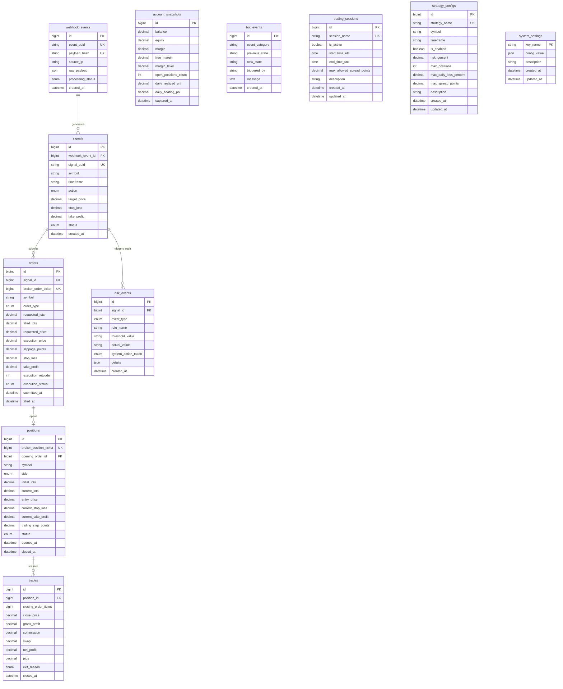

# Database Architecture, Schema Design & MySQL Workbench Manual

Hệ thống lưu trữ cơ sở dữ liệu cho **Hệ thống Giao dịch Tự động Vàng (XAUUSD)** được thiết kế và xây dựng độc quyền trên nền tảng **MySQL 8.0+ InnoDB**, sử dụng **SQLAlchemy 2.0 (Async + Sync)** và **Alembic** để quản lý di trú (migrations).

> **LƯU Ý BẢO MẬT & KIẾN TRÚC**:
> * SQLite, PostgreSQL, MongoDB bị nghiêm cấm trong kiến trúc này.
> * MySQL là nguồn chân lý duy nhất (Single Source of Truth) của dữ liệu.
> * MySQL Workbench chỉ dùng cho mục đích quan sát, truy vấn, đối soát dữ liệu (Inspecting) và quản trị DB. Tuyệt đối **không** nhúng business logic (Stored Procedures, Triggers phức tạp) vào MySQL Workbench hay Database.

---

## 1. Sơ đồ Thực thể - Mối quan hệ (Entity Relationship Diagram - ERD)



---

## 2. Đánh giá tính cần thiết của 11 Bảng Dữ liệu (Table Evaluation)

| STT | Tên Bảng | Mục đích | Tính cần thiết |
| :--- | :--- | :--- | :--- |
| 1 | `webhook_events` | Lưu raw payload, hash MD5/SHA256 chống duplicate replay attack trong 30s. | **Bắt buộc**: Đảm bảo an toàn mạng & truy vết TradingView. |
| 2 | `signals` | Đại diện ý định giao dịch chuẩn hóa (canonical intent). | **Bắt buộc**: Phân tách logic TradingView với lệnh Broker. |
| 3 | `orders` | Lưu ticket MT5, số lot fill, trượt giá slippage, retcode broker. | **Bắt buộc**: Bằng chứng gửi lệnh sang MetaTrader 5. |
| 4 | `positions` | Quản lý trạng thái vị thế đang mở hoặc đang trailing stop. | **Bắt buộc**: Quản lý rủi ro và giới hạn vị thế đồng thời. |
| 5 | `trades` | Lưu PnL thực tế đã đóng (gross, commission, swap, net profit). | **Bắt buộc**: Báo cáo tài chính, thống kê lợi nhuận / lỗ. |
| 6 | `account_snapshots`| Chụp ảnh số dư, equity định kỳ để theo dõi Max Drawdown. | **Bắt buộc**: Kiểm soát sụt giảm tài khoản trong ngày. |
| 7 | `risk_events` | Ghi log khi tín hiệu bị từ chối do vi phạm quy tắc rủi ro. | **Bắt buộc**: Minh bạch lý do bot không vào lệnh. |
| 8 | `bot_events` | Ghi nhận thay đổi trạng thái RUNNING, PAUSED, EMERGENCY_STOP. | **Bắt buộc**: Nhật ký an toàn và can thiệp của người dùng. |
| 9 | `trading_sessions` | Quản lý khung giờ các phiên London, New York và trần spread. | **Cần thiết**: Cho phép linh hoạt bật/tắt phiên không cần deploy lại code. |
| 10 | `strategy_configs` | Cấu hình tham số chiến lược (risk %, max position, timeframe). | **Cần thiết**: Mở rộng nhiều chiến lược trên XAUUSD hoặc các cặp tiền khác. |
| 11 | `system_settings` | Dynamic key-value cấu hình bot lưu dưới dạng JSON. | **Cần thiết**: Thay đổi cờ runtime mà không cần khởi động lại process. |

---

## 3. Quy chuẩn Kiểu dữ liệu Tiền tệ & Tài chính (Precision Standard)

Tuyệt đối không dùng `FLOAT` hoặc `DOUBLE` cho các giá trị tài chính:
* **Số dư & Vốn (Balance, Equity, Margin, PnL)**: `DECIMAL(14, 2)` (Chính xác đến cent/centime).
* **Giá vào / Ra / Cắt lỗ / Chốt lời (Entry, Exit, SL, TP)**: `DECIMAL(12, 5)` (Hỗ trợ 2 số lẻ cho Vàng XAUUSD 2650.25 và 5 số lẻ cho Forex).
* **Khối lượng giao dịch (Lots)**: `DECIMAL(8, 2)` (Bước nhảy tối thiểu 0.01 lot).
* **Điểm trượt giá / Spread (Points / Pips)**: `DECIMAL(8, 2)` hoặc `DECIMAL(10, 1)`.
* **Phần trăm rủi ro (Risk %)**: `DECIMAL(5, 2)` (ví dụ: `1.00%`, `3.50%`).
* **Thời gian**: Lưu trữ chuẩn UTC Timestamp `DATETIME`.

---

## 4. Quản lý Di trú Cơ sở Dữ liệu với Alembic (Migration Strategy)

Toàn bộ schema được đồng bộ và quản lý phiên bản qua Alembic trong thư mục `backend/alembic`.

### Các câu lệnh thao tác cơ sở dữ liệu:

1. **Khởi tạo cơ sở dữ liệu & Cấp quyền người dùng**:
   ```sql
   -- Chạy file script trong MySQL Workbench hoặc Command Line
   mysql -u root -p < "backend/scripts/init_mysql.sql"
   ```

2. **Chạy Migration đưa schema lên phiên bản mới nhất**:
   ```bash
   cd "backend"
   python -m alembic upgrade head
   ```

3. **Kiểm tra phiên bản migration hiện tại**:
   ```bash
   cd "backend"
   python -m alembic current
   ```

4. **Rollback migration về trạng thái trước đó (Downgrade)**:
   ```bash
   cd "backend"
   python -m alembic downgrade -1
   ```

5. **Rollback toàn bộ bảng về ban đầu (Clean Reset)**:
   ```bash
   cd "backend"
   python -m alembic downgrade base
   ```

6. **Reset môi trường phát triển (Development DB Reset)**:
   ```bash
   cd "backend"
   python -m alembic downgrade base
   python -m alembic upgrade head
   python scripts/seed_db.py
   ```

---

## 5. Cơ chế Kháng lỗi & Kết nối Bền bỉ (Database Resilience)

Tệp [`backend/app/database/session.py`](file:///d:/BOT%20Giao%20d%E1%BB%8Bch/backend/app/database/session.py) thiết lập cơ chế chịu tải cao:
* **Connection Pooling**: 
  - `pool_size = 10`: Duy trì sẵn 10 kết nối thường trực.
  - `max_overflow = 20`: Cho phép mở rộng thêm tới 20 kết nối khi có đợt biến động mạnh (burst requests).
  - `pool_timeout = 30`: Chờ tối đa 30 giây lấy connection từ pool trước khi trả về lỗi.
* **Pool Recycle & Pre-Ping**:
  - `pool_recycle = 1800` (30 phút): Định kỳ tái tạo kết nối, loại bỏ tình trạng MySQL đóng kết nối (`MySQL server has gone away - Error 2006`).
  - `pool_pre_ping = True`: Tự động gửi ping kiểm tra kết nối còn sống trước khi cấp phát cho request.
* **Quản trị Transaction nguyên tử (`transaction_scope`)**:
  - Tự động `rollback()` toàn bộ nếu có bất kỳ bước xử lý lệnh nào thất bại.
  - Không bao giờ để lại bản ghi rác hoặc vị thế lơ lửng không khớp ticket MT5.
  - Tích hợp Exponential Backoff Retry (3 lần thử lại tự động khi mất kết nối mạng tạm thời).

---

## 6. Hướng dẫn chi tiết MySQL Workbench

### 6.1. Cài đặt MySQL Server 8.0+ trên Windows
1. Tải **MySQL Community Server 8.0+** từ trang chủ: `https://dev.mysql.com/downloads/installer/`
2. Chọn cài đặt **Server only** hoặc **Developer Default** (bao gồm MySQL Workbench).
3. Đặt mật khẩu cho tài khoản `root` (ví dụ: `StrongRootPass2026!`).
4. Đảm bảo Windows Service `MySQL80` đang ở trạng thái **Running**.

### 6.2. Tạo Database và Cấp quyền User
1. Mở **MySQL Workbench**.
2. Nhấp vào kết nối **Local instance MySQL80** (đăng nhập bằng user `root`).
3. Mở file [init_mysql.sql](file:///d:/BOT%20Giao%20d%E1%BB%8Bch/backend/scripts/init_mysql.sql) bằng menu: `File` -> `Open SQL Script...`
4. Bấm biểu tượng tia sét ⚡ (**Execute**) để thực thi toàn bộ script.
5. Kiểm tra mục **Schemas** ở panel bên trái: schema `tradebot_db` xuất hiện.

### 6.3. Tạo Kết nối riêng cho TradeBot trong Workbench
1. Tại màn hình chính của Workbench, bấm dấu `+` cạnh mục **MySQL Connections**.
2. Thiết lập thông số:
   * **Connection Name**: `TradeBot_Local`
   * **Hostname**: `127.0.0.1`
   * **Port**: `3306`
   * **Username**: `tradebot_user`
   * Bấm **Store in Vault ...** và nhập mật khẩu: `StrongTradeBotPass2026!`
   * **Default Schema**: `tradebot_db`
3. Bấm **Test Connection** -> Hiện thông báo `Successfully made the MySQL connection`. Bấm **OK**.

### 6.4. Các truy vấn hữu ích trong MySQL Workbench (SQL Inspection Snippets)

Mở một SQL Tab mới (`Ctrl + T`) và dán các truy vấn sau để theo dõi hoạt động của Bot:

#### A. Xem lịch sử lệnh đóng và PnL thực tế (Trades & Net Profit):
```sql
SELECT 
    t.id,
    p.broker_position_ticket,
    p.symbol,
    p.side,
    p.initial_lots,
    p.entry_price,
    t.close_price,
    t.net_profit,
    t.commission,
    t.swap,
    t.pips,
    t.exit_reason,
    t.closed_at
FROM trades t
JOIN positions p ON t.position_id = p.id
ORDER BY t.closed_at DESC
LIMIT 20;
```

#### B. Xem các tín hiệu gần nhất từ TradingView (Signals Pipeline):
```sql
SELECT 
    s.id,
    s.signal_uuid,
    s.symbol,
    s.timeframe,
    s.action,
    s.target_price,
    s.stop_loss,
    s.take_profit,
    s.status,
    s.rejection_reason,
    s.created_at
FROM signals s
ORDER BY s.created_at DESC
LIMIT 20;
```

#### C. Đối soát các sự kiện rủi ro và lý do bị từ chối (Risk Events & Errors):
```sql
SELECT 
    r.id,
    r.signal_id,
    r.event_type,
    r.rule_name,
    r.threshold_value,
    r.actual_value,
    r.system_action_taken,
    r.details,
    r.created_at
FROM risk_events r
ORDER BY r.created_at DESC
LIMIT 20;
```

#### D. Xem lịch sử thay đổi trạng thái Bot (Bot Lifecycle):
```sql
SELECT 
    id,
    event_category,
    previous_state,
    new_state,
    triggered_by,
    message,
    created_at
FROM bot_events
ORDER BY created_at DESC
LIMIT 20;
```

#### E. Xem sụt giảm vốn tài khoản theo thời gian (Drawdown Tracking):
```sql
SELECT 
    captured_at,
    balance,
    equity,
    free_margin,
    margin_level,
    open_positions_count,
    daily_realized_pnl,
    daily_floating_pnl
FROM account_snapshots
ORDER BY captured_at DESC
LIMIT 20;
```
